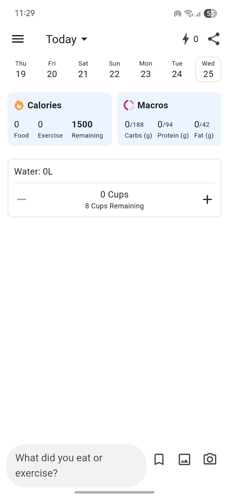
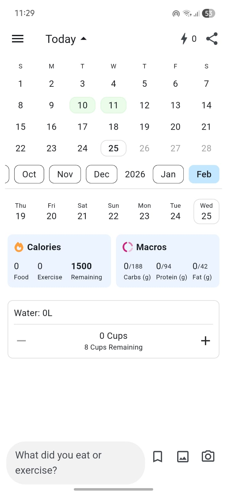
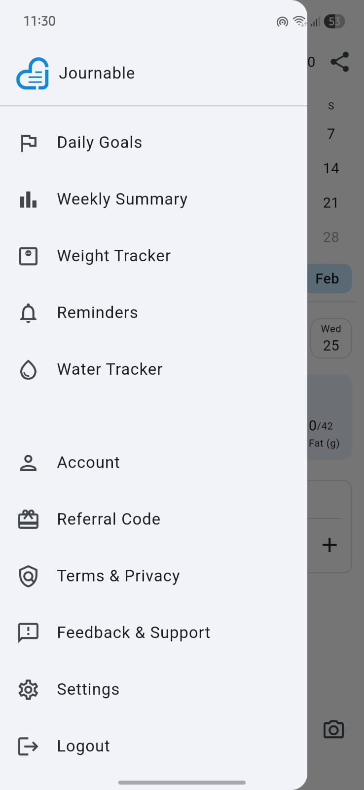

# Fitway 🏃‍♂️💦

Fitway is a modern, clean, and intuitive fitness tracking application that helps you stay on top of your daily goals, macronutrients, and hydration. With a sleek UI and responsive design, Fitway adapts seamlessly from your desktop down to your mobile device.

## ✨ Features

- **Daily Goal Tracking**: Log your daily calorie intake and exercise to meet your net calorie goals.
- **Macronutrients Breakdown**: Monitor your carbs, protein, and fat intake dynamically.
- **Hydration Tracker**: Keep track of your daily water intake with a quick and interactive cup interface.
- **Responsive Dashboard**: Beautiful light/dark mode UI designed for mobile and web.
- **Intuitive Navigation**: Easily move across tools including weight tracking, calendar summaries, and settings using the accessible sidebar.

## 📸 Screenshots

### Mobile Dashboard View


### Desktop / Expanded View


### Navigation Sidebar


## 🚀 Getting Started

Follow these steps to run the frontend application locally:

1. Navigate to the frontend directory:
   ```bash
   cd Frontend
   ```

2. Install the necessary dependencies:
   ```bash
   npm install
   ```

3. Start the Vite development server:
   ```bash
   npm run dev
   ```

4. Open your browser and navigate to `http://localhost:5173/` to view the app.

## 🛠️ Tech Stack

- **Frontend Framework:** React + Vite
- **Styling:** Custom CSS (Variables, Responsive Media Queries, Light/Dark Modes)
- **Icons:** Lucide React

## 📄 License

This project is licensed under the MIT License.
